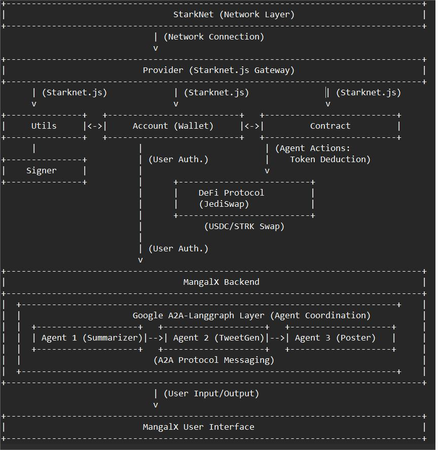

# MangalX

## Overview

MangalX is a decentralized, AI-driven platform designed to facilitate the creation, management, and monetization of autonomous AI agents within a Web3 ecosystem. Built on [StarkNet](https://starknet.io/) (a Layer-2 solution on Ethereum using ZK-Rollups), MangalX leverages a multi-agent framework powered by [Langgraph](https://github.com/langchain-ai/langgraph) and Google’s [Agent2Agent (A2A)](https://github.com/google/agent2agent) protocol for secure agent coordination. The platform simplifies complex blockchain operations and enables tokenized workflows using USDC and STRK (StarkNet’s native token) through DeFi protocols like [JediSwap](https://jediswap.xyz/).

## Hackathon Proof-of-Concept (POC)

The hackathon POC demonstrates a news-to-Twitter pipeline:
- **Agent 1 (Summarizer)**: Processes a news article to generate a summary (150 words) using NLP.
- **Agent 2 (TweetGen)**: Converts the summary into a Twitter-compatible post (≤280 characters).
- **Agent 3 (Poster)**: Publishes the tweet to Twitter/X via API.
- Each agent’s action is tokenized (e.g., $0.02 USDC for summarization, swapped to STRK), with transactions logged on StarkNet.

## Architecture

MangalX integrates AI and blockchain components:
- **Frontend**: React.js single-page app with a chatbot UI for user input/output.
- **Backend**: FastAPI (Python) server with a single endpoint (`/api/query`), orchestrating agents via Langgraph.
- **Multi-Agent System**: Langgraph with A2A protocol for secure communication between agents (Agent 1 → Agent 2 → Agent 3).
- **Blockchain**: StarkNet smart contracts (written in Cairo) handle token deductions and transaction logging.
- **DeFi**: JediSwap facilitates USDC/STRK swaps for agent payments.

For a detailed architecture diagram, refer to the presentation slides.

## Workflow

The workflow for the news-to-Twitter pipeline is illustrated in the following diagram:
- **workflow.png**: A flowchart depicting the data flow from user input to Agent 1 (Summarizer), Agent 2 (TweetGen), Agent 3 (Poster), and the final output (tweet ID and transaction hash).



## Use Cases

MangalX has the capability to support various multi-agent use cases in future:
- News-to-Twitter Pipeline
- Asset Bridging Automation
- Token Swapping Workflow
- Liquidity Deposit Management
- Social Media Account Management
- Marketing Strategy Execution

## Impact

- **Developers**: Monetize AI agents with STRK rewards, fostering open-source innovation.
- **Users**: Simplified Web3 interaction through automated workflows.
- **Ecosystem**: Enhances StarkNet adoption with scalable AI-blockchain solutions.

## Prerequisites

- Python 3.13 or higher
- [UV](https://github.com/astral-sh/uv)

## Running the Samples

Run one (or more) [agent](/samples/python/agents/README.md) A2A server and one of the [host applications](/samples/python/hosts/README.md).

The following example will run the langgraph agent with the python CLI host:

## Prerequisites

- Python 3.13 or higher
- UV
The following example will run the langgraph agent with the python CLI host:

1. Run an agent:
    ```bash
    uv run agents/langgraph
    ```
2. Run the example client
    ```
    uv run hosts/cli
    ```
---
**NOTE:** 
This is sample code and not production-quality libraries.
---

